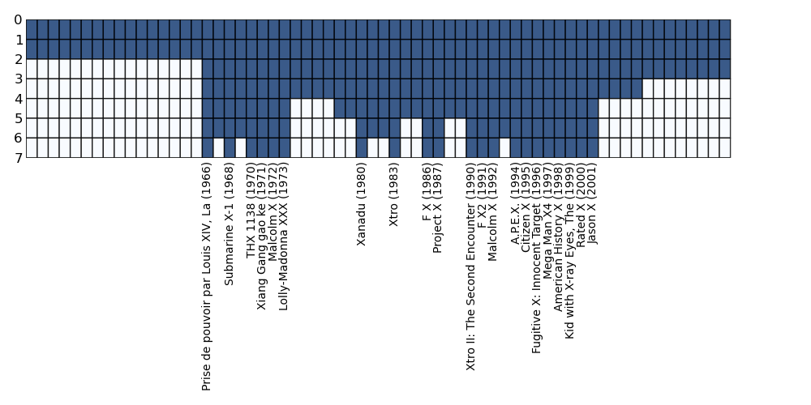

XLtrie
======

An implementation of using the x-fast trie for fast predecessor search. Illustrated with an example of the problem of searching for the closest movie release meeting some arbitrary condition.

### The X-movies example.

Rather than getting all theoretical, let us start with a simple and illustrative example. With movie and tv show titles such as `X-files`, `X-men` and `American History X`, we have a trope of `X` standing for anything misterious (and heavily implied to be hip). How often are movies with such titles released? What was the first X-movie released since your birth?

To find out, let us build the X-fast trie index for such `X`-titled movies by the year of release.

Here is a plot of what we get:

